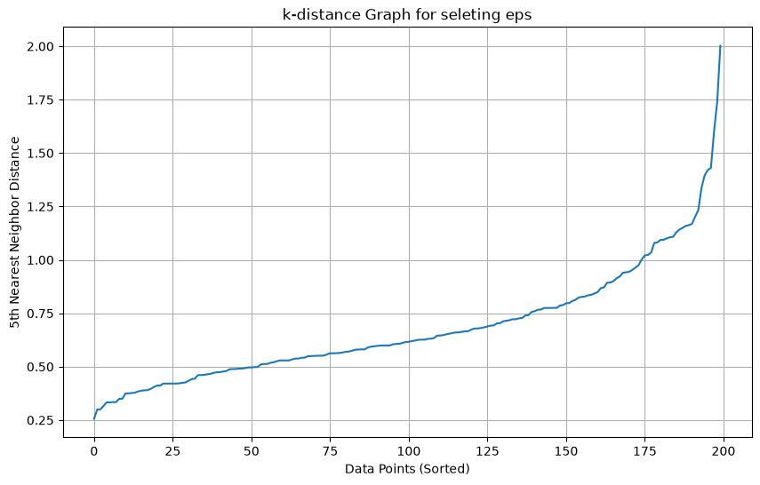
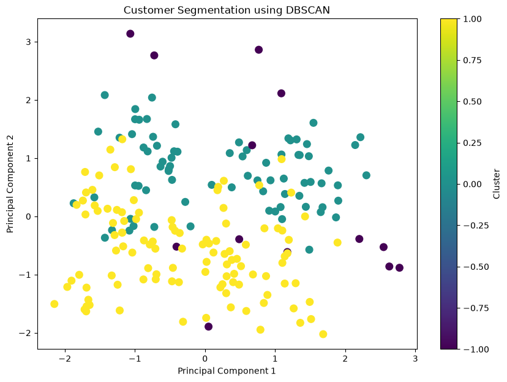

# Customer Segmentation using DBSCAN Clustering

## Project Overview

This project demonstrates customer segmentation using **DBSCAN (Density-Based Spatial Clustering of Applications with Noise)** on the Mall Customer Segmentation dataset.

Unlike K-Means and Hierarchical Clustering, DBSCAN groups customers based on **data density** and automatically detects **outliers (noise points)** without requiring the number of clusters as input.

The project covers data preprocessing, feature scaling, parameter selection using the **k-distance graph**, dimensionality reduction using PCA, cluster visualization, customer profiling, and business insights.

---

## Dataset

**Dataset:** Mall Customer Segmentation Dataset

### Features

- CustomerID
- Gender
- Age
- Annual Income (k$)
- Spending Score (1-100)

---

## Technologies Used

- Python
- Jupyter Notebook
- Pandas
- NumPy
- Matplotlib
- Seaborn
- Scikit-learn

---

## Machine Learning Concepts Covered

- Unsupervised Learning
- DBSCAN Clustering
- Density-Based Clustering
- Outlier Detection
- Hyperparameter Tuning
- k-Distance Graph
- Feature Scaling
- Label Encoding
- Principal Component Analysis (PCA)
- Customer Segmentation

---

## Project Workflow

1. Load Dataset
2. Exploratory Data Analysis (EDA)
3. Data Cleaning
4. Label Encoding
5. Feature Scaling using StandardScaler
6. Generate k-Distance Graph
7. Select Optimal `eps`
8. Train DBSCAN Model
9. PCA for Cluster Visualization
10. Customer Cluster Profiling
11. Business Insights

---

## Results

The DBSCAN algorithm successfully identified:

- **2 customer clusters**
- **13 noise (outlier) customers**

Unlike K-Means, DBSCAN automatically detected customers that did not belong to any dense region, making it effective for anomaly detection.

---

## Project Structure

```text
DBSCAN_Clustering/
│
├── Customer_Segmentation_DBSCAN.ipynb
├── Mall_Customers.csv
├── Images/
│   ├── K_Distance_Graph.png
│   ├── Customer_Segmentation.png
│   └── Cluster_Profile.png
├── requirements.txt
├── .gitignore
└── README.md
```

---

## k-Distance Graph

The **k-distance graph** was used to determine the optimal value of **eps**.

The elbow point of the graph suggested selecting:

- **eps = 1.0**
- **min_samples = 5**



---

## Customer Segmentation

The following visualization shows the customer groups identified by DBSCAN after applying PCA for dimensionality reduction.

Customers labeled **-1** represent noise (outliers).



---

## Cluster Profile

The average Age, Annual Income, and Spending Score were calculated for each cluster to better understand customer characteristics.

| Cluster | Description |
|----------|-------------|
| Cluster 0 | Regular customer group |
| Cluster 1 | Active customer group |
| Cluster -1 | Outliers / Unusual customer behavior |

---

## Key Learnings

During this project, I learned:

- How DBSCAN performs density-based clustering.
- The importance of selecting appropriate values for `eps` and `min_samples`.
- How to interpret the k-distance graph.
- How DBSCAN identifies Core Points, Border Points, and Noise Points.
- The importance of feature scaling in distance-based algorithms.
- How PCA helps visualize clusters.
- How to generate business insights from customer segmentation.
- The advantages and limitations of DBSCAN compared with K-Means and Hierarchical Clustering.

---

## Skills Demonstrated

- Python Programming
- Pandas
- NumPy
- Data Cleaning
- Exploratory Data Analysis (EDA)
- Label Encoding
- StandardScaler
- Principal Component Analysis (PCA)
- DBSCAN Clustering
- Density-Based Clustering
- Outlier Detection
- Hyperparameter Tuning
- Customer Segmentation
- Cluster Profiling
- Business Insight Generation
- Data Visualization

---

## Future Improvements

- Experiment with different values of `eps` and `min_samples`.
- Compare DBSCAN with K-Means and Hierarchical Clustering.
- Evaluate clustering quality using:
  - Silhouette Score
  - Davies-Bouldin Index
  - Calinski-Harabasz Index
- Apply DBSCAN to larger real-world datasets.
- Explore **HDBSCAN** for datasets with varying densities.

---

## Author

**Anuj Bhatt**

Aspiring Machine Learning Enthusiast.